Vamos a aprender como obligar a tus usuarios a autenticarse con Google para poder utilizar tu aplicación, esto lo podemos hacer en una aplicación nueva o existente de manera fácil.

## Creando nuestro proyecto en Firebase
Lo primero va a ser crear un proyecto y una aplicación en [Firebase](https://console.firebase.google.com/), para eso nos vamos a dirigir a la [consola de Firebase](https://console.firebase.google.com/)

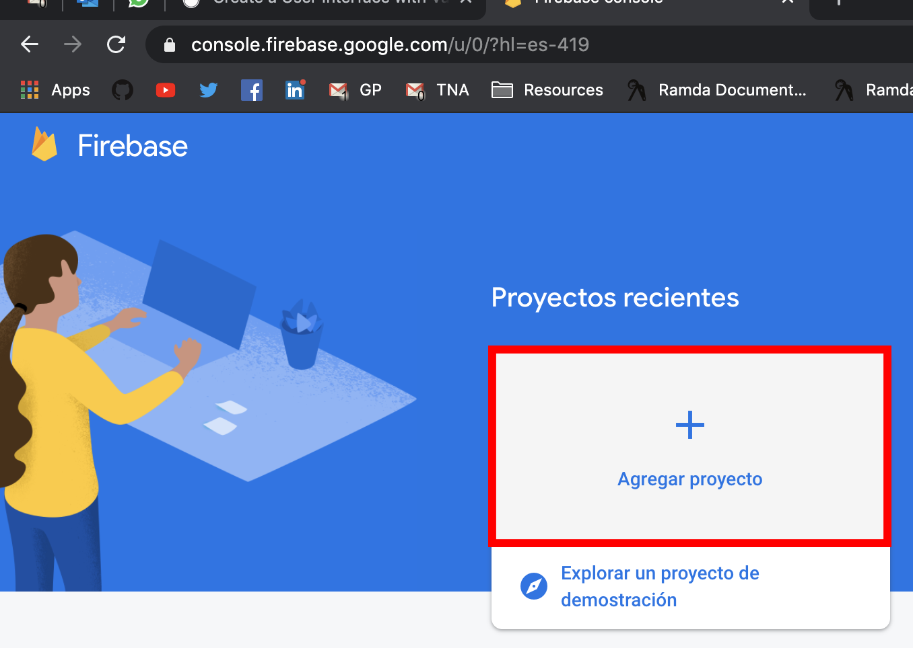

Vamos a clickear en "Nuevo proyecto" y completamos los datos necesarios.


Una vez creado clickeamos en "Autenticación" en el panel izquierdo.

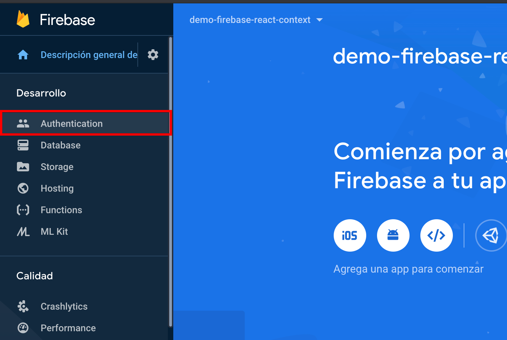

Luego en "Configura el método de acceso"

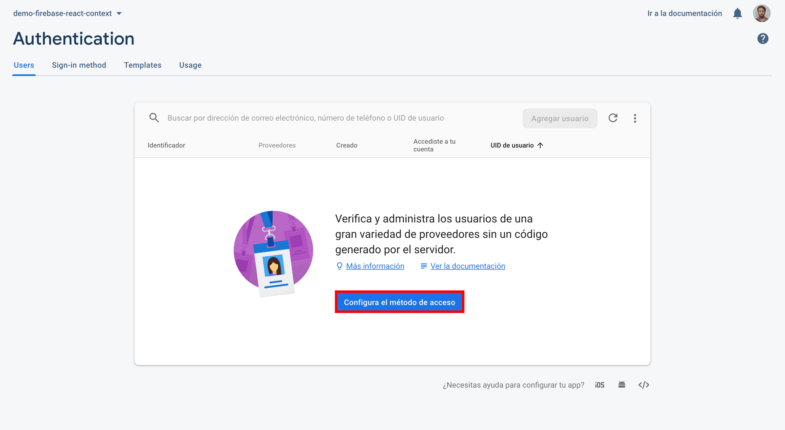

En este caso vamos a usar Google, lo seleccionamos, llenamos los campos y clickeamos "Guardar"

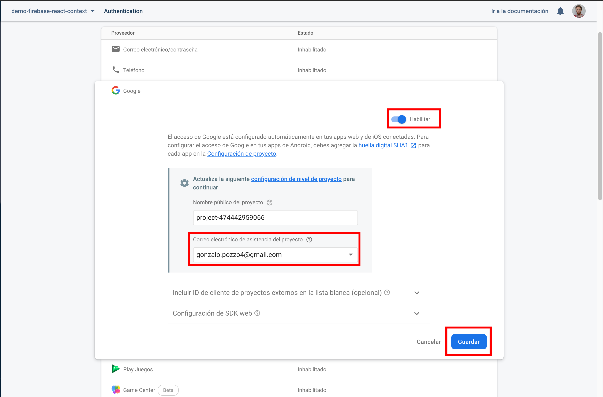

Ahora volvemos al inicio del proyecto y clickeamos sobre el botón de "Web" para crear nuestra aplicación

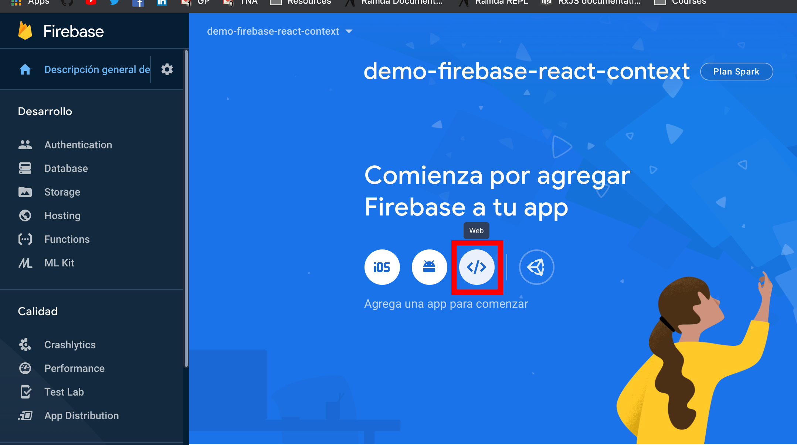

> Antes creamos el proyecto y ahora la aplicación, son entidades diferentes ya que un proyecto puede tener varias aplicaciones con configuraciones diferentes

Le damos un nombre a nuestra aplicación y clickeamos en "Registrar app"

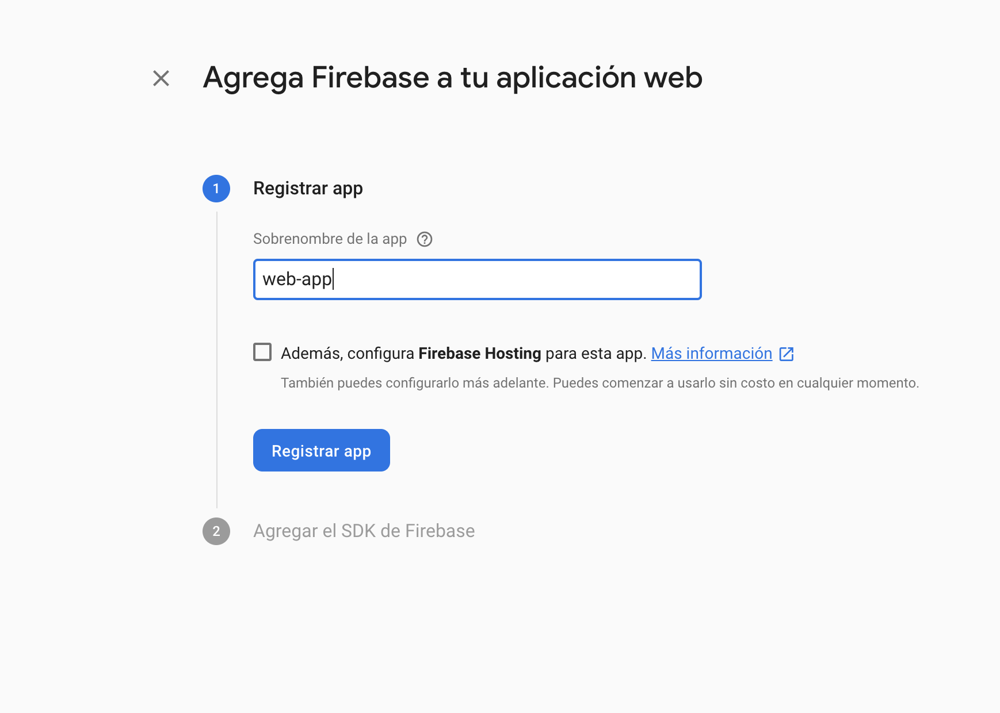

Nos vamos a copiar el contenido de la variable `firebaseConfig` para dentro de un rato

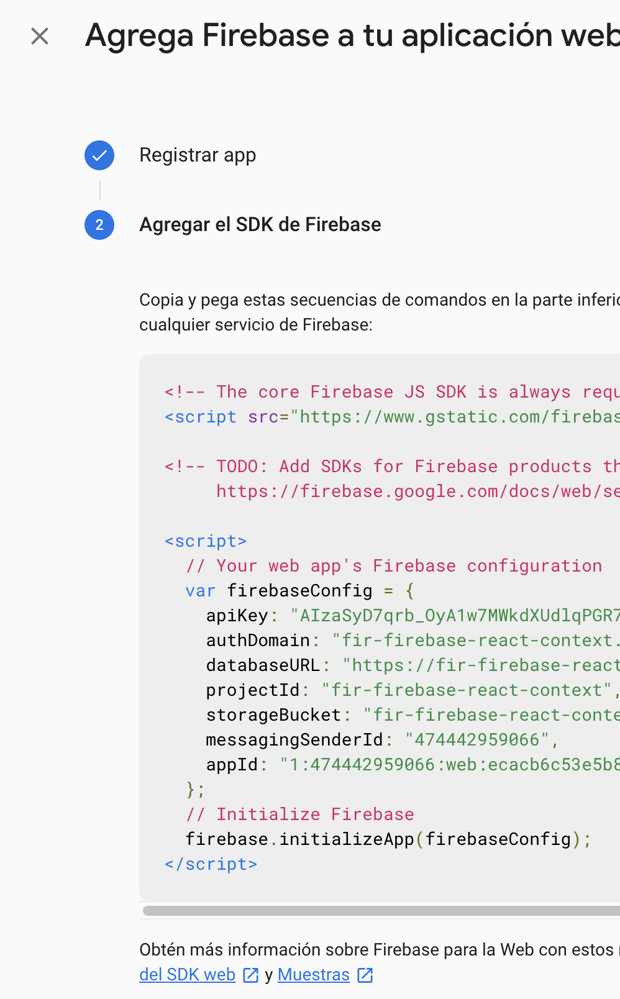

## Creando nuestra aplicación React
Vamos a usar [Create React App](https://create-react-app.dev/) para crear una aplicación muy simple. Para eso nos vamos a ir a la terminal, nos vamos a parar en nuestra carpeta de proyectos (o donde quieras crear el proyecto) y vamos a ejecutar:

```bash
npx create-react-app firebase-context-demo
```

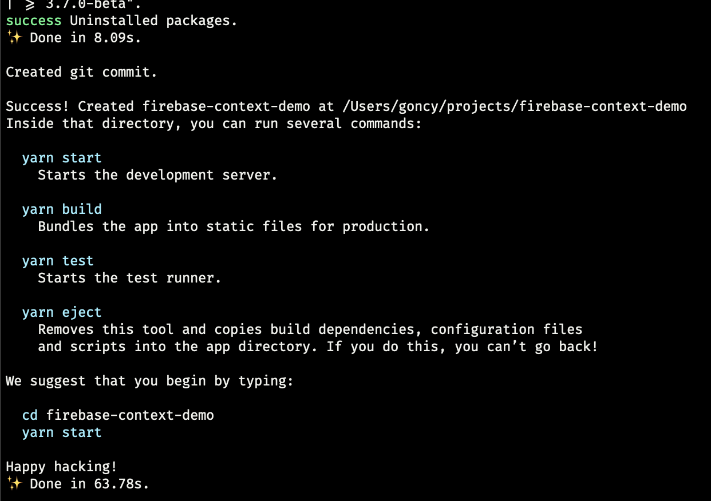

## Configurando nuestra aplicación
Una vez que termine vamos a entrar en la carpeta ejecutando:
```bash
cd firebase-context-demo
```

Y vamos a agregar Firebase a nuestro proyecto ejecutando:

```bash
npm install firebase
```

Ahora vamos a crear un archivo `.env` en la raíz de nuestro proyecto y vamos a pegar la configuración de Firebase que sacamos de la variable `firebaseConfig` más arriba, convirtiendo todas las variables a mayúsculas, con guiones bajos, el prefijo REACT_APP y asegurandose de que no queden comas al final de cada línea.


Ahora vamos a correr nuestra aplicación ejecutando:
```bash
npm start
```

Una vez que termine se nos va a abrir un navegador con una aplicación parecida a esta:

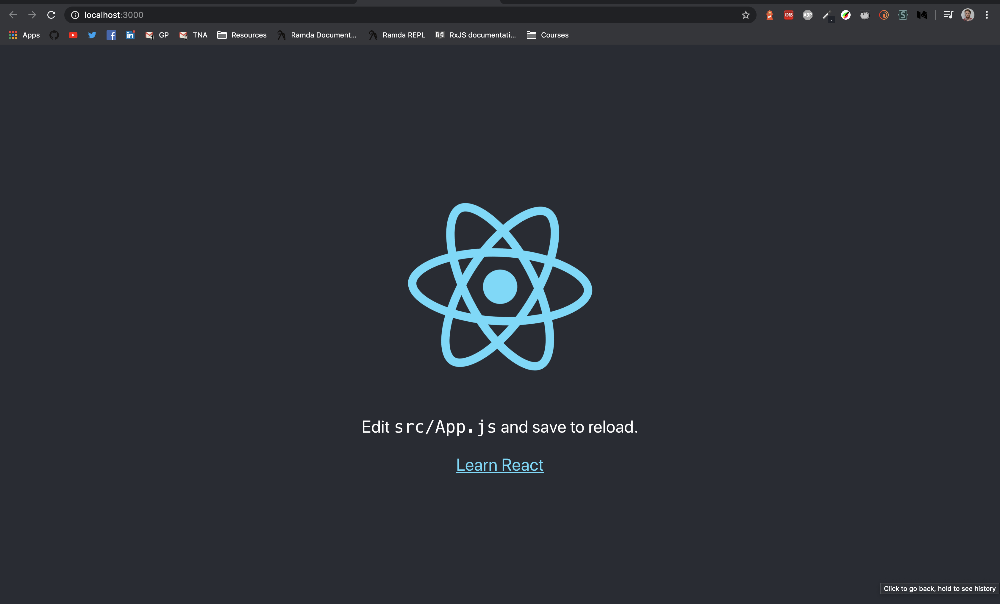

Listo, ya estamos listos para ponernos a codear!

## Integrando Firebase
Vamos a crear un archivo `firebase.js` dentro de `src` con el siguiente contenido:

```js
import firebase from "firebase/app";

import "firebase/auth";

firebase.initializeApp({
  apiKey: process.env.REACT_APP_API_KEY,
  authDomain: process.env.REACT_APP_AUTH_DOMAIN,
  databaseURL: process.env.REACT_APP_DATABASE_URL,
  projectId: process.env.REACT_APP_PROJECT_ID,
  storageBucket: process.env.REACT_APP_STORAGE_BUCKET,
  messagingSenderId: process.env.REACT_APP_MESSAGING_SENDER_ID,
  appId: process.env.REACT_APP_APP_ID,
});

const auth = firebase.auth();
const providers = {
  google: new firebase.auth.GoogleAuthProvider(),
};

export { auth, providers };
export default firebase;
```

De esta manera inicializamos Firebase y exportamos las variables que vamos a necesitar en nuestra aplicación.

Vamos a crear una carpeta `session` dentro de `src` donde vamos a manejar todo lo referido a la sesión del usuario. Dentro de esa carpeta vamos a crear los archivos `context.js`, `api.js`, `screens/Login.js` y `hooks.js`.


A nuestro `api.js` le vamos a dar el siguiente contenido:
```js
import { auth, providers } from "../firebase";

export default {
  signIn: () => auth.signInWithPopup(providers.google),
  signOut: () => auth.signOut(),
  onChange: (callback) => auth.onAuthStateChanged(callback),
};
```

Vamos a tener un metodo para iniciar sesión, uno para cerrar sesión y un para escuchar cada vez que haya un cambio en la sesión.

A nuestro `screens/Login.js` le vamos a dar el siguiente contenido:
```jsx
import React from "react";

const LoginScreen = ({ signIn, status }) => (
  <div>
    {status === "init" && <span>Intentando de restaurar sesión...</span>}
    {status === "restored" && <button onClick={signIn}>Iniciar sesión con Google</button>}
  </div>
);

export default LoginScreen;
```
El componente va a recibir una prop `signIn` que se va a ejecutar cuando se clickee en "Iniciar sesión con Google" y va a mostrar diferentes mensajes dependiendo del valor de una prop `status`.

En tanto a `context.js` le vamos a dar el siguiente contenido:
```jsx
import React from "react";

import auth from "./api";
import Login from "./screens/Login";

const SessionContext = React.createContext(null);

const SessionProvider = ({ children }) => {
  const [user, setUser] = React.useState(null);
  const [status, setStatus] = React.useState("init");

  React.useEffect(() => {
    auth.onChange(user => {
      setUser(user);

      setStatus("restored");
    });
  }, []);

  if (!user) return <Login signIn={auth.signIn} status={status} />;

  const state = { user };
  const actions = { signOut: auth.signOut, signIn: auth.signIn };

  return <SessionContext.Provider value={{ state, actions }}>{children}</SessionContext.Provider>;
};

export { SessionProvider as Provider, SessionContext as default };
```

Vamos a crear un componente que no solo, usando context, va a proveer de la información de sesión a toda la aplicación, sino que va a bloquear el renderizado en caso de que no haya una sesión activa.
También escuchamos dentro del `useEffect` todos los cambios de sesión que haya en Firebase para asegurarnos de que siempre tengamos la sesión actualizada.

> Notese que se usa el componente Login y se le pasan las 2 props necesarias

Por último vamos a darle el siguiente contenido a `hooks.js`:

```js
import React from "react";

import SessionContext from "./context";

export function useUser() {
  const {
    state: { user },
  } = React.useContext(SessionContext);

  return user;
}
```

Este hook nos va a permitir acceder a la información de sesión de una manera muy simple.

Nos vamos a dirigir a nuestro `index.js` y vamos a envolver nuestro componente `App` con nuestro `SessionProvider`:

```jsx
import React from 'react';
import ReactDOM from 'react-dom';

import {Provider as SessionProvider} from "./session/context"
import App from './App';

import * as serviceWorker from './serviceWorker';

import './index.css';

ReactDOM.render(
  <React.StrictMode>
    <SessionProvider>
      <App />
    </SessionProvider>
  </React.StrictMode>,
  document.getElementById('root')
);

// If you want your app to work offline and load faster, you can change
// unregister() to register() below. Note this comes with some pitfalls.
// Learn more about service workers: https://bit.ly/CRA-PWA
serviceWorker.unregister();
```

Ahora vamos a `App.js` para mostrar la información de sesión:

```jsx
import React from 'react';

import {useUser} from "./session/hooks"

import logo from './logo.svg';

import './App.css';

function App() {
  const user = useUser();

  return (
    <div className="App">
      <header className="App-header">
        
        <p>
          Edit <code>src/App.js</code> and save to reload.
        </p>
        <a
          className="App-link"
          href="https://reactjs.org"
          target="_blank"
          rel="noopener noreferrer"
        >
          Bienvenido: {user.displayName} - {user.email}
        </a>
      </header>
    </div>
  );
}

export default App;
```

Si volvemos al navegador vamos a ver lo siguiente:


Si clickeamos el botón nos va a llevar a la ventana de inicio de sesión de Google:

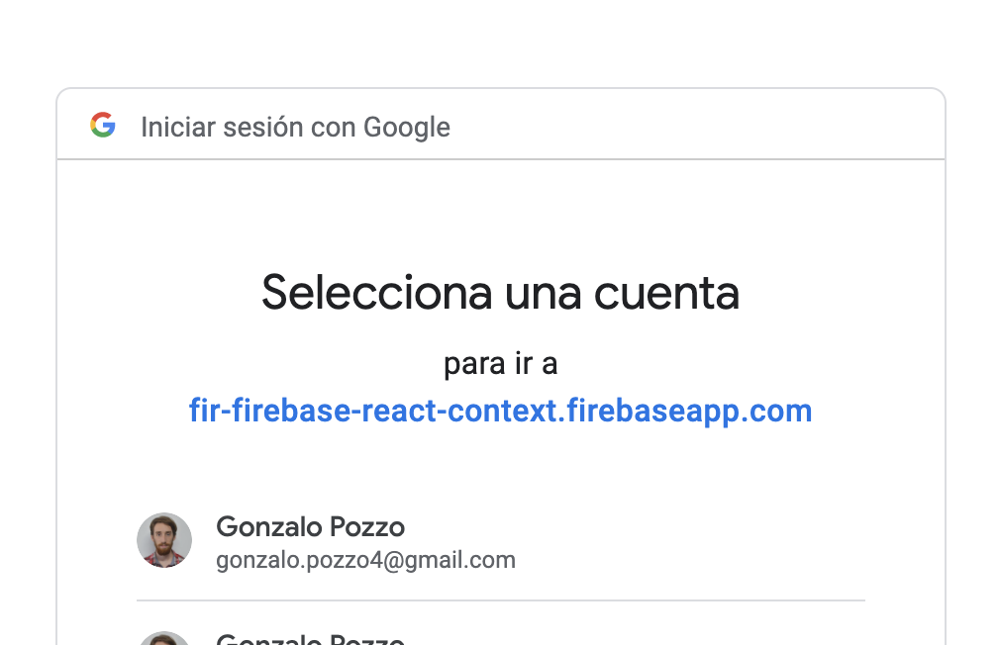

Y luego a nuestra aplicación!

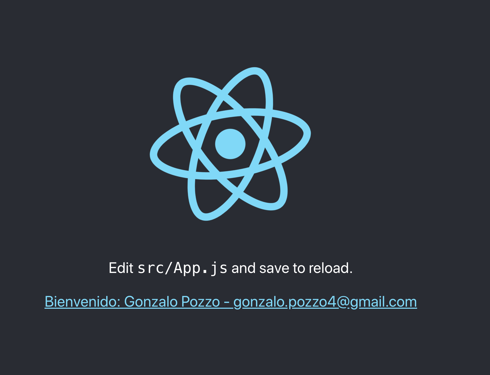

Si recargamos la página vamos a ver el mensaje "Intentando de restaurar sesión..." unos segundos y luego nuestra aplicación, no solo ya tenemos nuestra lógica de autenticación lista sino que también la de hidratación de sesión!

## Felicitaciones
Pero esto no termina acá, la autenticación puede ser también via mail, otros proveedores y más. Firebase tambien tiene servicios de bases de datos como Firestore, muy fáciles de usar (mucho mas fácil todavía si ya tenemos Firebase configurado en nuestra aplicación como ahora). Así que a investigar! O a esperar el próximo post 🤪

## Repositorio
Si querés ver el proyecto terminado o repasar algo, podés encontrar el repositorio [acá](https://github.com/goncy/blog/tree/master/src/content/autenticacion-con-firebase-en-react/repo)

> Después de clonarlo renombrá el archivo `.env.template` a `.env` e ingresá tus credenciales de Firebase
