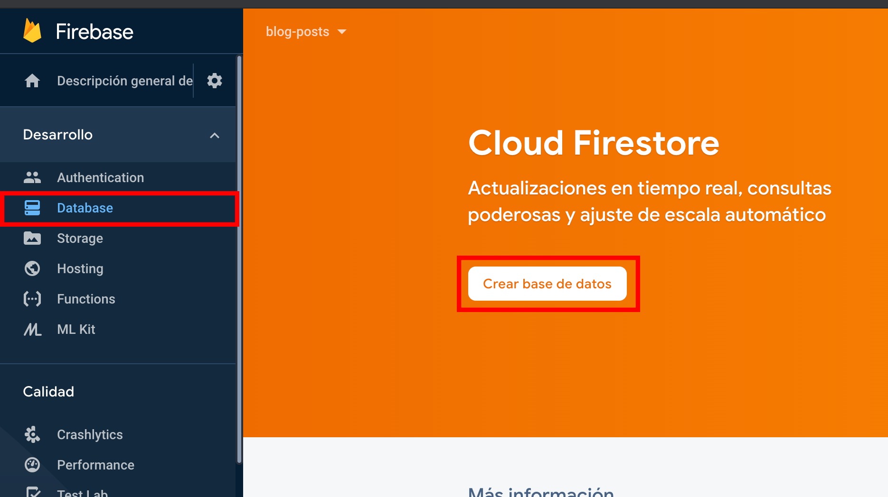
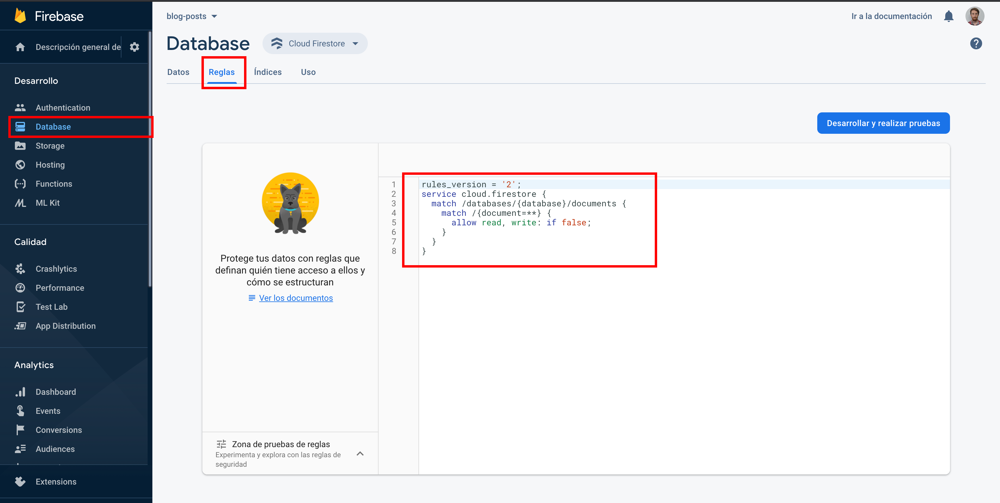

Vamos a aprender a conectar nuestra aplicación a la base de datos en tiempo real de Firebase Firestore para obtener información basada en la sesión activa, asegurandonos que nadie pueda acceder a información que no le pertenece.

## Preparación
En [este post](/autenticacion-firebase-react-context) aprendimos a agregar autenticación a una aplicación React con Firebase y React Context, también aprendimos a crear un proyecto y una aplicación en Firebase, así que como necesitamos exactamente eso vamos a usarla como base para este post. Si no querés leerlo pero querés ver el código lo tenés [acá](https://github.com/goncy/blog/tree/master/src/content/autenticacion-con-firebase-en-react/repository).

Repasando un poco la estructura de nuestra aplicación tenemos algo asi:

```md
.
└── .env # Credenciales de Firebase
└── src/
    └── firebase.js # configuración de firebase
    └── session/ # Todo lo relativo a la sesión del usuario
        ├── api.js # Métodos de inicio, cierre y sincronización de sesión
        ├── context.js # Provider de React Context encargado de bloquear el renderizado de nuestra aplicación si el usuario no inició sesión
        ├── hooks.js # Hooks para obtener información de la sesión
        └── screens/ # Pantallas relativas a la sesión
          └── Login.js # Pantalla de inicio de sesión
```

## Agregando Firestore a nuestro proyecto Firebase
Abrimos la [consola de Firebase](https://console.firebase.google.com/) y clickeamos en "Database" en el panel izquierdo y luego en "Crear base de datos".



Se nos va a abrir un panel con una serie de pasos, le damos siguiente a todo.

Una vez en la pantalla de "Database" nos dirigimos a la pestaña de "Reglas", configuramos las siguientes reglas y clickeamos en "Publicar":



```
rules_version = '2';
service cloud.firestore {
  match /users/{userId}/{document=**} {
    match /databases/{database}/documents {
      allow read, write: if request.auth.uid == userId;
    }
  }
}
```

De esta manera le indicamos a Firestore que cada usuario va a tener su propia colección en la base de datos y que solo va a poder leer y escribir si su `userId` concuerda con el del usuario en sesión.

## Integrando Firebase Firestore
Como ya tenemos instalada la dependencia de `firebase` no necesitamos instalar nada mas en nuestro proyecto, simplemente vamos a ir nuestro `firebase.js` y hacemos los siguientes cambios:

```js
import firebase from "firebase/app";

import "firebase/auth";
import "firebase/firestore"; // Agregamos firestore

firebase.initializeApp({
  apiKey: process.env.REACT_APP_API_KEY,
  authDomain: process.env.REACT_APP_AUTH_DOMAIN,
  databaseURL: process.env.REACT_APP_DATABASE_URL,
  projectId: process.env.REACT_APP_PROJECT_ID,
  storageBucket: process.env.REACT_APP_STORAGE_BUCKET,
  messagingSenderId: process.env.REACT_APP_MESSAGING_SENDER_ID,
  appId: process.env.REACT_APP_APP_ID,
});

const database = firebase.firestore(); // Agregamos una instancia de firestore
const auth = firebase.auth();
const providers = {
  google: new firebase.auth.GoogleAuthProvider(),
};

export { auth, providers, database }; // Agregamos la instancia al export
export default firebase;
```

De esta manera tenemos un nuevo export `database` en nuestro `firebase.js` que vamos a usar para interactuar con Firestore.

## Agregando TODOs a nuestra aplicación
Cada usuario va a poder tener una lista de TODOs (cosas que debería hacer), empecemos creando una nueva carpeta `todo` dentro de `src` con los archivos `context.js`, `api.js`, `screens/Todos.js`, `screens/Loading.js y `hooks.js`.

> Si querés entender un poco más esta estructura de carpetas podés leer [este post](/reduciendo-boilerplate-react-redux)

A nuestro `api.js` le vamos a dar el siguiente contenido:

```js
import { database } from "../firebase";

export default {
  add: (user, todo) =>
    database
      .collection("users")
      .doc(user)
      .collection("todos")
      .add(todo),
  remove: (user, id) =>
    database
      .collection("users")
      .doc(user)
      .collection("todos")
      .doc(id)
      .delete(),
  onChange: (user, callback) =>
    database
      .collection("users")
      .doc(user)
      .collection("todos")
      .onSnapshot(snapshot => callback(snapshot.docs.map(doc => ({ id: doc.id, ...doc.data()})))),
};
```

Para comunicarnos con Firestore usamos el export `database` que importamos de `firebase.js`, sobre database llamamos a `.collection`, podemos pensar las collections como "carpetas" que almacenan documentos, en este caso queremos la "carpeta" usuarios. Luego llamamos a `.doc`, podemos pensar los documentos como si fueran "archivos" dentro de las "carpetas", en este caso queremos el documento con el mismo id que el usuario que le pasemos (el usuario en sesión).

Las collections tienen metodos como `.add` para agregar elementos a esa "carpeta" u `.onSnapshot` para suscribirnos a cambios que haya en esa "carpeta" (similar a lo que hacemos con la sesión del usuario), mientras que los documentos tienen metodos como `.update` o `.delete`.

> Tip: Cada vez que nosotros hacemos .add, .update, .delete, se llama al metodo .onSnapshot, por lo que no es necesario escuchar cada cambio individualmente

El único metodo medio extraño en este archivo es el `onChange`, no te preocupes, es algo que vas a copiar y pegar la mayoría de las veces, no algo que tengas que aprenderte de memoria. Básicamente lo que estamos haciendo es, cada vez que haya un cambio en la "carpeta" TODOs del usuario en sesión, pasale todos los TODOs (snapshots.docs) a la función `callback` que le pasamos como parametro. Nosotros no nos vamos a guardar una propiedad `id` para cada TODO asi que simplemente extraemos el id del documento de Firstore y se lo agregamos a cada TODO.

En tanto a `context.js` le vamos a dar el siguiente contenido:
```jsx
import React from "react";

import { useUser } from "../session/hooks";

import api from "./api";
import Loading from "./screens/Loading";

const TodoContext = React.createContext({});

const TodoProvider = ({ children }) => {
  const user = useUser();
  const [todos, setTodos] = React.useState([]);
  const [status, setStatus] = React.useState("pending");

  function add(text) {
    api.add(user.uid, { text, status: "pending" });
  }

  function remove(id) {
    api.remove(user.uid, id);
  }

  React.useEffect(() => {
    api.onChange(user.uid, (todos) => {
      setTodos(todos);

      setStatus("resolved");
    });

    return () => setStatus("pending");
  }, [user.uid]);

  if (status === "pending") return <Loading />;

  const state = { todos };
  const actions = { add, update, remove };

  return <TodoContext.Provider value={{ state, actions }}>{children}</TodoContext.Provider>;
};

export { TodoProvider as Provider, TodoContext as default };

```

Nos vamos a dar cuenta que el contenido es muy parecido al de nuestro `session/context.js`. Importamos nuestro `api.js`, creamos un par de métodos para exportar en los `actions` de nuestro provider (que luego consumimos con hooks), creamos un estado para almacenar el listado de TODOs, bloqueamos el renderizado hasta fetchear los TODOs por primera vez, nos subscribimos a los cambios de los TODOs y no mucho más. Algo a notar es que nuestro provider sigue siendo un componente común y corriente, por lo tanto podémos hacer uso del hook de `useUser` para obtener el id del usuario.

Vamos a crear el component de `screens/Loading.js` con el siguiente contenido:
```jsx
import React from "react";

const LoadingScreen = () => <span>Cargando todos...</span>;

export default LoadingScreen;
```

Bueno, pueden hacer las cosas bien y armar algo mejor que yo.

Ahora vamos a `hooks.js` y le damos el siguiente contenido:
```js
import React from "react";

import TodoContext from "./context";

export function useTodos() {
  const {
    state: { todos },
    actions: { add, remove }
  } = React.useContext(TodoContext);

  return [
    todos.map(todo => ({
      ...todo,
      remove: () => remove(todo.id),
    })),
    add
  ];
}
```
Ahora usando el hook de `useTodos` vamos a poder acceder al listado de TODOs y dentro de cada TODO vamos a poder llamar a `remove` para borrarlo, eso va a ejecutar el `onChange` que estamos escuchando en nuestro context, actualizando la data sin que nosotros hagamos nada más. También estamos devolviendo como segundo valor en el array una función `add` para agregar un nuevo TODO.

> Tip: Firestore refleja el cambio automáticamente en nuestra aplicación, luego intenta sincronizar ese cambio en segundo plano, en caso de que falle va a restaurar el estado original en nuestra aplicación, por lo que no necesitariamos spinners o loadings.

Ahora vamos a `screens/Todos.js` y le damos el siguiente contenido:
```jsx
import React from "react";

import {useTodos} from "../hooks"

const TodosScreen = () => {
  const [todos, add] = useTodos();

  function handleAdd(e) {
    e.preventDefault();

    add(e.target.text.value);

    e.target.text.value = "";
  }

  return (
    <div>
      <form onSubmit={handleAdd}>
        <input name="text" type="text" />
        <button type="submit">Agregar</button>
      </form>
      <ul>
        {todos.map(({id, text, remove}) => (
          <li key={id}>
            <span>{text}</span>
            <button onClick={remove}>X</button>
          </li>
        ))}
      </ul>
    </div>
  )
};

export default TodosScreen;
```
Iteramos todos los TODOs que tenemos en nuestra lista y mostramos su texto y un botón para borrarlo, adicionalmente tenemos un formulario para agregar un TODO nuevo.

Ahora vamos a `index.js` y hacemos los siguientes cambios:
```jsx
import React from 'react';
import ReactDOM from 'react-dom';

import {Provider as SessionProvider} from "./session/context"
import {Provider as TodoProvider} from "./todo/context" // Importamos el TodoProvider
import Todos from "./todo/screens/Todos"; // Importamos la pantalla de Todos

import * as serviceWorker from './serviceWorker';

import './index.css';

ReactDOM.render(
  <React.StrictMode>
    <SessionProvider>
      <TodoProvider>
        <Todos />
      <TodoProvider>
    </SessionProvider>
  </React.StrictMode>,
  document.getElementById('root')
);

// If you want your app to work offline and load faster, you can change
// unregister() to register() below. Note this comes with some pitfalls.
// Learn more about service workers: https://bit.ly/CRA-PWA
serviceWorker.unregister();
```

> Es importante que TodoProvider esté dentro de SessionProvider por que necesitamos la sesión para obtener los TODOs

De esta manera reemplazamos nuestra aplicación con nuestro formulario de TODOs, la funcionalidad de autenticación no debería haber cambiado y ahora deberíamos poder ver el listado de TODOs y borrar / agregar elementos.


> Tip: Para comprobar que es en tiempo real agrega / modifica elementos en una nueva pestaña o directamente desde la consola de Firebase

## Código
Si querés ver el código del proyecto terminado o repasar algo, podés encontrarlo [acá](https://github.com/goncy/blog/tree/master/src/content/base-de-datos-en-tiempo-real-con-firebase-firestore-en-react/repository).

> Antes de correrlo renombrá el archivo `.env.template` a `.env` e ingresá tus credenciales de Firebase
